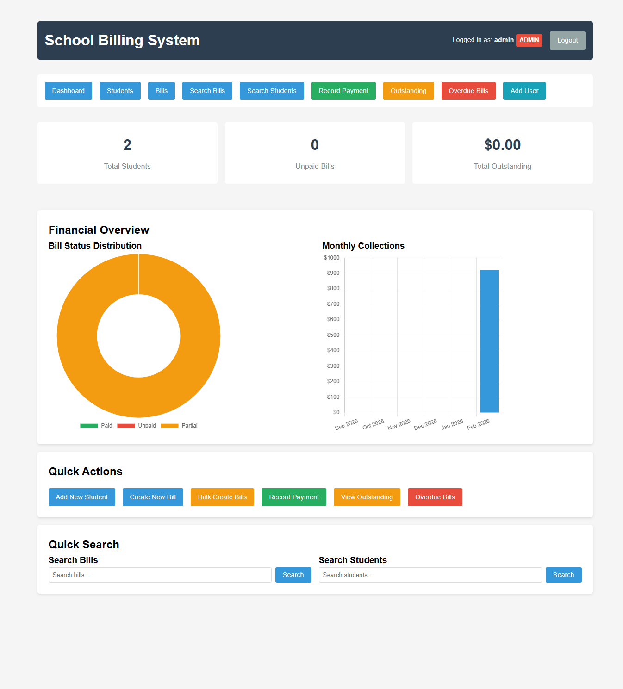
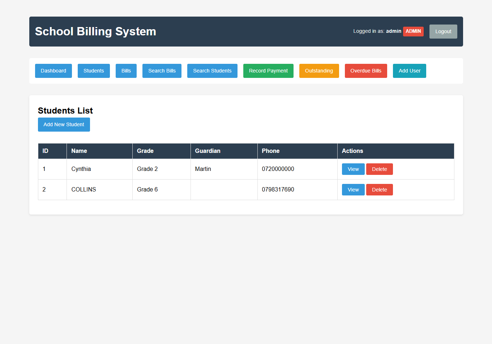
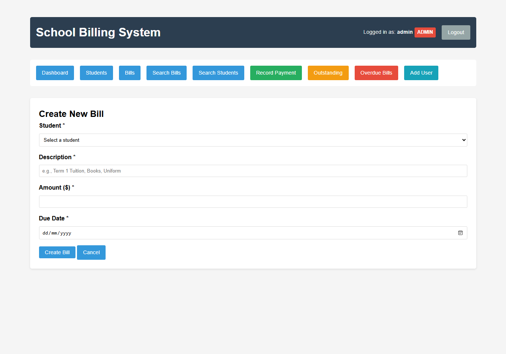
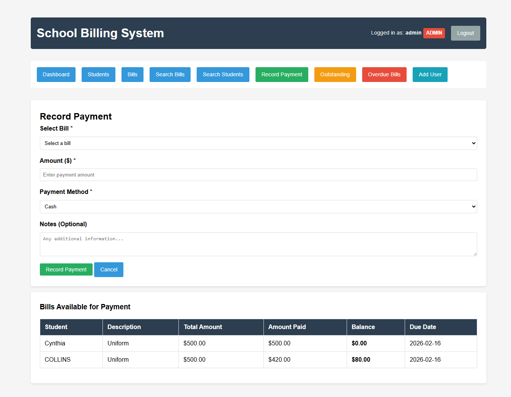

@'
# 🏫 School Billing System

<div align="center">


**A complete, production-ready billing management system for educational institutions**

[Live Demo](#) • [Features](#-features) • [Installation](#-installation) • [Screenshots](#-screenshots)

</div>

## 📋 Overview

The School Billing System is a comprehensive web application designed to streamline financial operations in educational institutions. It provides schools with an efficient way to manage student fees, track payments, generate reports, and automate communication with parents/guardians.

## ✨ Features

### 📊 **Core Management**
- **👥 Student Management** - Add, edit, delete student profiles
- **💰 Bill Creation** - Create individual or bulk bills for students
- **💳 Payment Processing** - Record payments with automatic receipt generation
- **🔍 Advanced Search** - Filter bills and students by various criteria

### 📈 **Reporting & Analytics**
- **📋 Outstanding Reports** - View all pending payments
- **💰 Collections Reports** - Track daily/monthly collections
- **📊 Dashboard Charts** - Visual data representation with Chart.js
- **📄 PDF Export** - Export reports and receipts as PDF files

### 🔐 **Security & Automation**
- **👤 User Authentication** - Role-based access (Admin/Staff/Viewer)
- **📧 Email Notifications** - Automatic overdue bill reminders
- **🔒 Session Management** - Secure login system
- **📱 Responsive Design** - Works on desktop and mobile

### ⚡ **Advanced Features**
- **🚀 Bulk Operations** - Create bills for multiple students at once
- **🎯 Quick Actions** - Mark bills as paid with one click
- **🔔 Overdue Alerts** - Automatic email notifications
- **📈 Financial Analytics** - Monthly trends and insights

## 🖼️ Screenshots

### Login Page


### Dashboard


### Student Management


### Billing Interface


### Payment Processing


### Reports


### PDF Exports


## 🚀 Quick Start

### Prerequisites
- Python 3.8 or higher
- pip (Python package manager)

### Installation

1. **Clone the repository**
   ```bash
   git clone https://github.com/jaxman25/school-billing-system.git
   cd school-billing-system